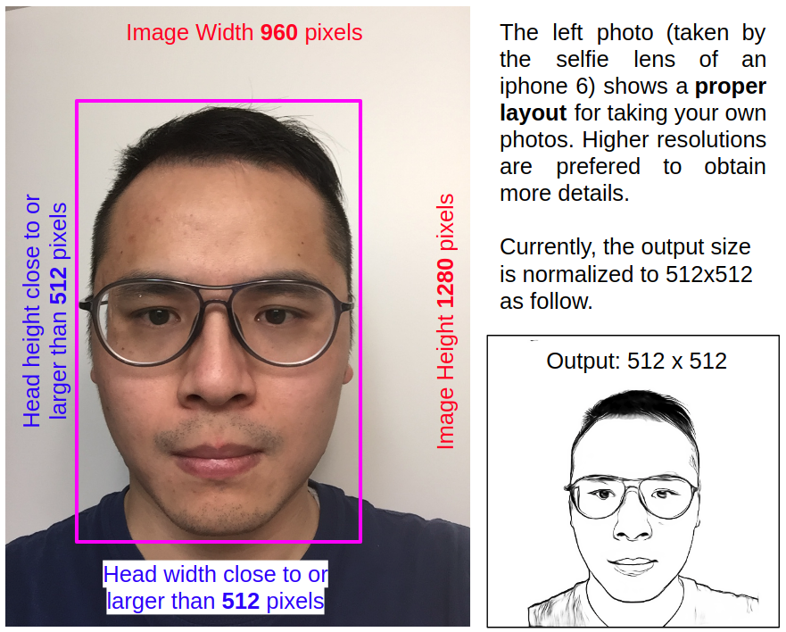

# U^2-Net (U square net)

The code for our paper **U^2-Net (U square net)** published in Pattern Recognition 2020:
## [U^2-Net: Going Deeper with Nested U-Structure for Salient Object Detection](https://arxiv.org/pdf/2005.09007.pdf)

[Xuebin Qin](https://webdocs.cs.ualberta.ca/~xuebin/), <br/>
[Zichen Zhang](https://webdocs.cs.ualberta.ca/~zichen2/), <br/>
[Chenyang Huang](https://chenyangh.com/), <br/>
[Masood Dehghan](https://sites.google.com/view/masooddehghan), <br/>
[Osmar R. Zaiane](http://webdocs.cs.ualberta.ca/~zaiane/) and <br/>
[Martin Jagersand](https://webdocs.cs.ualberta.ca/~jag/).

__Contact__: xuebin[at]ualberta[dot]ca

## Updates !!!

**(2021-Feb-15)** We just released an online demo [**http://profu.ai**](http://profu.ai) for the portrait generation. Please feel free to give it a try and provide any suggestions or comments. <br/>
 <br/>

**(2021-Feb-06)** Recently, some people asked the problem of using U^2-Net for human segmentation, so we trained another example model for human segemntation based on [**Supervisely Person Dataset**](https://supervise.ly/explore/projects/supervisely-person-dataset-23304/datasets). <br/>

(1) To run the human segmentation model, please first downlowd the [**u2net_human_seg.pth**](https://drive.google.com/file/d/1-Yg0cxgrNhHP-016FPdp902BR-kSsA4P/view?usp=sharing) model weights into ``` ./saved_models/u2net_human_seg/```. <br/>
(2) Prepare the to-be-segmented images into the corresponding directory, e.g. ```./test_data/test_human_images/```. <br/>
(3) Run the inference by command: ```python u2net_human_seg_test.py``` and the results will be output into the corresponding dirctory, e.g. ```./test_data/u2net_test_human_images_results/```<br/>
[**Notes: Due to the labeling accuracy of the Supervisely Person Dataset, the human segmentation model (u2net_human_seg.pth) here won't give you hair-level accuracy. But it should be more robust than u2net trained with DUTS-TR dataset on general human segmentation task. It can be used for human portrait segmentation, human body segmentation, etc.**](https://github.com/NathanUA/U-2-Net)<br/>

 <br/>


**(2020-Dec-28)** Some interesting applications and useful tools based on U^2-Net: <br/>
(1) [**Xiaolong Liu**](https://github.com/LiuXiaolong19920720) developed several very interesting applications based on U^2-Net including [**Human Portrait Drawing**](https://www.cvpy.net/studio/cv/func/DeepLearning/sketch/sketch/page/)(As far as I know, Xiaolong is the first one who uses U^2-Net for portrait generation), [**image matting**](https://www.cvpy.net/studio/cv/func/DeepLearning/matting/matting/page/) and [**so on**](https://www.cvpy.net/). <br/>
(2) [**Vladimir Seregin**](https://github.com/peko/nn-lineart) developed an interesting tool, [**NN based lineart**](https://peko.github.io/nn-lineart/), for comparing the portrait results of U^2-Net and that of another popular model, [**ArtLine**](https://github.com/vijishmadhavan/ArtLine), developed by [**Vijish Madhavan**](https://github.com/vijishmadhavan). <br/>
(3) [**Daniel Gatis**](https://github.com/danielgatis/rembg) built a python tool, [**Rembg**](https://pypi.org/project/rembg/), for image backgrounds removal based on U^2-Net. I think this tool will greatly facilitate the application of U^2-Net in different fields. <br/>

**(2020-Nov-21)** Recently, we found an interesting application of U^2-Net for [**human portrait drawing**](https://www.pythonf.cn/read/141098). Therefore, we trained another model for this task based on the [**APDrawingGAN dataset**](https://github.com/yiranran/APDrawingGAN).


### Usage for portrait generation
1. Clone this repo to local
```
git clone https://github.com/NathanUA/U-2-Net.git
```

2. Download the [**u2net_portrait.pth**](https://drive.google.com/file/d/1IG3HdpcRiDoWNookbncQjeaPN28t90yW/view?usp=sharing) model and put it into the directory: ```./saved_models/u2net_portrait/```.

3. Run on the testing set. <br/>
(1) Download the train and test set from [**APDrawingGAN**](https://github.com/yiranran/APDrawingGAN). These images and their ground truth are stitched side-by-side (512x1024). You need to split each of these images into two 512x512 images and put them into ```./test_data/test_portrait_images/portrait_im/```. You can also download the split testing set on [GoogleDrive](https://drive.google.com/file/d/1NkTsDDN8VO-JVik6VxXyV-3l2eo29KCk/view?usp=sharing). <br/>
(2) Running the inference with command ```python u2net_portrait_test.py``` will ouptut the results into ```./test_data/test_portrait_images/portrait_results```. <br/>

4. Run on your own dataset. <br/>
(1) Prepare your images and put them into ```./test_data/test_portrait_images/your_portrait_im/```. [**To obtain enough details of the protrait, human head region in the input image should be close to or larger than 512x512. The head background should be relatively clear.**](https://github.com/NathanUA/U-2-Net) <br/>
(2) Run the prediction by command ```python u2net_portrait_demo.py``` will outputs the results to ```./test_data/test_portrait_images/your_portrait_results/```. <br/>
(3) The difference between ```python u2net_portrait_demo.py``` and ```python u2net_portrait_test.py``` is that we added a simple [**face detection**](https://opencv-python-tutroals.readthedocs.io/en/latest/py_tutorials/py_objdetect/py_face_detection/py_face_detection.html) step before the portrait generation in ```u2net_portrait_demo.py```.  Because the testing set of APDrawingGAN are normalized and cropped to 512x512 for including only heads of humans, while our own dataset may varies with different resolutions and contents. Therefore, the code ```python u2net_portrait_demo.py``` will detect the biggest face from the given image and then crop, pad and resize the ROI to 512x512 for feeding to the network. The following figure shows how to take your own photos for generating high quality portraits.



**(2020-Sep-13)** Our U^2-Net based model is the **6th** in [**MICCAI 2020 Thyroid Nodule Segmentation Challenge**](https://tn-scui2020.grand-challenge.org/Resultannouncement/).

**(2020-May-18)** The official paper of our **U^2-Net (U square net)** ([**PDF in elsevier**(free until July 5 2020)](https://www.sciencedirect.com/science/article/pii/S0031320320302077?dgcid=author), [**PDF in arxiv**](http://arxiv.org/abs/2005.09007)) is now available. If you are not able to access that, please feel free to drop me an email.

**(2020-May-16)** We fixed the upsampling issue of the network. Now, the model should be able to handle **arbitrary input size**. (Tips: This modification is to facilitate the retraining of U^2-Net on your own datasets. When using our pre-trained model on SOD datasets, please keep the input size as 320x320 to guarantee the performance.)

**(2020-May-16)** We highly appreciate **Cyril Diagne** for building this fantastic AR project: [**AR Copy and Paste**](https://github.com/cyrildiagne/ar-cutpaste) using our **U^2-Net** (Qin *et al*, PR 2020) and [**BASNet**](https://github.com/NathanUA/BASNet)(Qin *et al*, CVPR 2019). The [**demo video**](https://twitter.com/cyrildiagne/status/1256916982764646402) in twitter has achieved over **5M** views, which is phenomenal and shows us more application possibilities of SOD.

## U^2-Net Results (176.3 MB)


## Our previous work: [BASNet (CVPR 2019)](https://github.com/NathanUA/BASNet)

## Required libraries

Python 3.6  
numpy 1.15.2  
scikit-image 0.14.0  
python-opencv
PIL 5.2.0  
PyTorch 0.4.0  
torchvision 0.2.1  
glob  

## Usage for salient object detection
1. Clone this repo
```
git clone https://github.com/NathanUA/U-2-Net.git
```
2. Download the pre-trained model [u2net.pth (176.3 MB)](https://drive.google.com/file/d/1ao1ovG1Qtx4b7EoskHXmi2E9rp5CHLcZ/view?usp=sharing) or [u2netp.pth (4.7 MB)](https://drive.google.com/file/d/1rbSTGKAE-MTxBYHd-51l2hMOQPT_7EPy/view?usp=sharing) and put it into the dirctory './saved_models/u2net/' and './saved_models/u2netp/'

3.  Cd to the directory 'U-2-Net', run the train or inference process by command: ```python u2net_train.py```
or ```python u2net_test.py``` respectively. The 'model_name' in both files can be changed to 'u2net' or 'u2netp' for using different models.  

 We also provide the predicted saliency maps ([u2net results](https://drive.google.com/file/d/1mZFWlS4WygWh1eVI8vK2Ad9LrPq4Hp5v/view?usp=sharing),[u2netp results](https://drive.google.com/file/d/1j2pU7vyhOO30C2S_FJuRdmAmMt3-xmjD/view?usp=sharing)) for datasets SOD, ECSSD, DUT-OMRON, PASCAL-S, HKU-IS and DUTS-TE.


## U^2-Net Architecture


## Quantitative Comparison


## Qualitative Comparison


## Citation
```
@InProceedings{Qin_2020_PR,
title = {U2-Net: Going Deeper with Nested U-Structure for Salient Object Detection},
author = {Qin, Xuebin and Zhang, Zichen and Huang, Chenyang and Dehghan, Masood and Zaiane, Osmar and Jagersand, Martin},
journal = {Pattern Recognition},
volume = {106},
pages = {107404},
year = {2020}
}
```
